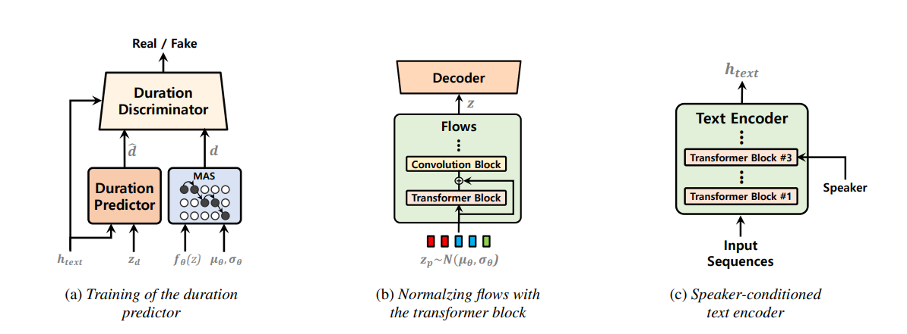

# VITS2: VITS2: Mejora de la Calidad y Eficiencia en Síntesis de Voz en una Sola Etapa mediante Aprendizaje Adversarial y Diseño Arquitectónico
## Jungil Kong, Jihoon Park, Beomjeong Kim, Jeongmin Kim, Dohee Kong, Sangjin Kim

Implementación no oficial del artículo [VITS2 paper](https://arxiv.org/abs/2307.16430), secuela del artículo original [VITS paper](https://arxiv.org/abs/2106.06103). 
Ademas de que este repositorio esta basado en el repositorio original de [VITS2 p0p4k](https://github.com/p0p4k/vits2_pytorch) Thank you so much!



Los modelos de síntesis de voz a partir de texto en una sola etapa han avanzado significativamente en los últimos años, logrando superar a los sistemas tradicionales de dos etapas en términos de calidad y eficiencia. Sin embargo, los modelos previos aún presentan ciertas limitaciones, como la falta de naturalidad en algunos momentos, alta demanda computacional y una fuerte dependencia de la conversión fonémica.

VITS2 es un modelo de síntesis de voz en una sola etapa que aborda estas limitaciones mediante mejoras en la arquitectura y los mecanismos de entrenamiento. En comparación con su predecesor, VITS2 ofrece:

* Mayor naturalidad en la voz generada mediante nuevas estructuras y estrategias de entrenamiento.
* Mejor adaptación a múltiples hablantes, asegurando mayor similitud en las características de la voz.
* Mayor eficiencia en el entrenamiento e inferencia, reduciendo costos computacionales.
* Menor dependencia de la conversión fonémica, lo que permite un enfoque completamente end-to-end sin necesidad de transcripción fonética intermedia.
Con estas mejoras, VITS2 establece un nuevo estándar en modelos de síntesis de voz, optimizando tanto la calidad como la accesibilidad de estos sistemas en aplicaciones reales. 

## Creditos
-  [VITS repo](https://github.com/jaywalnut310/vits)
- [VITS2 p0p4k](https://github.com/p0p4k/vits2_pytorch)

## **Requisitos Previos**  
    En este caso, se considera que no entrenaras el modelo como tal, solo haras inferencia, para su uso de forma local, aun que podrias intentar usarlo en un Colab (no se a testeado)
1. **Python** >= 3.10  
2. **PyTorch** versión 2.3.0.  
3. Clonar este repositorio.
4. Instalar los requisitos de Python.
```sh 
pip install -r requirements.txt
```
5. Nececitas instalar Espeak, en el caso de Linux es sencillo, solo debes usar el siguiente comando. Sin embargo para Windows, recomendamos altamente el siguiente tutorial [Tutorial](https://www.youtube.com/watch?v=BBlivx6o0WM)
```sh 
apt-get install espeak
```
6. Para windows igualmente se deben descargar las herramientas de desarrolo de Visual Studio, en especifico *Desarrollo para el escritorio con C++* que podras encontrar en [Visual studio](https://visualstudio.microsoft.com/es/thank-you-downloading-visual-studio/?sku=Community&channel=Release&version=VS2022&source=VSLandingPage&cid=2030&passive=false)

7. Ejecunta el siguiente comando para poder compilar la libreria de *monotonic_align*
```sh
# Cython-version Monotonoic Alignment Search
cd monotonic_align
python setup.py build_ext --inplace

```
8. Para poder usar el modelo actual usa el notebook de inferencia, ahi encontraras el prototipo, los modelos los podras encontrar en el siguiente drive [Modelos](https://drive.google.com/drive/folders/1GDOh8VqPcJNO-0dKtMc_B5dAoU-0p9Ht?usp=sharing).
(De momento dentro de la carpeta AMA esta el modelo entrenado, lo descargar y lo pones en la carpeta de modelos, no lo subo directo al repositorio debido a su peso)

### ToDos
1. Interfaz grafica.
2. Catalogo mas aplio de voces.
3. Voz de lengua originaria.
4. LLM para chateo con voz.
